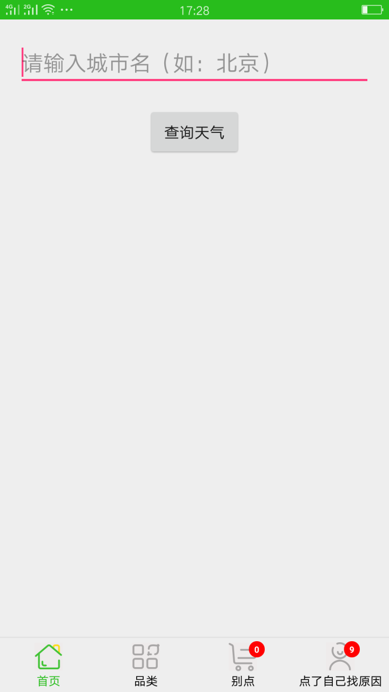
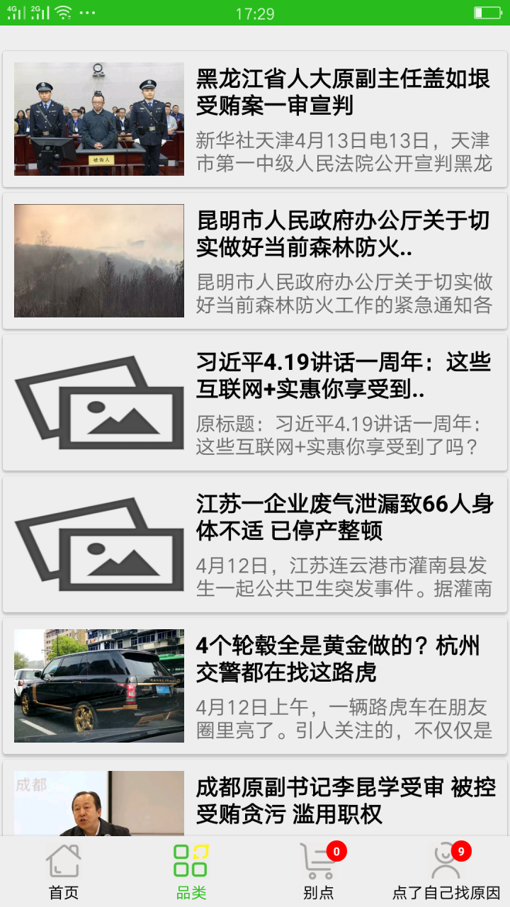

# MvpRxRetrofit(Star me after you read this page pleases)
Android项目框架，使用MVP解耦，使用Rxjava链式调用访问网络，其他业务处理也可以用Rx，使用Retrofit网络请求以及数据缓存
>使用方法以及详解，接下来更新，其实代码里面注释写得很清楚，不过，我后面再完善吧
>架构还需要封装更多的东西，但是这需要针对具体项目进行封装

## **MVP + RxJava2 + Retrofit2 + Glide*-

## **简介**
美图，天气查询应用
- Android一些次新的技术的一个合集示例
- API来自网络免费API
- MVP模式（使用ViewDelegate解耦，非常感谢**kymjs**提供的mvp思想，在他的基础上我有一些改动，希望能在这个应用上做个最佳实践）@kymjs(https://github.com/kymjs/TheMVP)
- leakcanary的使用
- Retrofit（+RxJava）网络请求
- Glide加载缓存图片（瀑布流卡片显示）

## **版本**
- 修改百度API为易源官方API（仅修改了新闻）
- 修复“最新新闻”模块没有数据的问题
- 抽取出一个公共的recyclerview代理类（grid，list合二为一），并支持下拉刷新
- 天气预报查询，弹窗提醒
- 修改新闻列表为cardview展示
- 支持新闻查看详情，CollapsingToolbarLayout +　NestedScrollView + ToorBarLayout
- 支持右滑返回
d- 增加*离线缓存*机制(使用Retrofit和Okhttp实现网络缓存)
- 崩溃捕捉并写入本地文件(有存储卡写到存储卡，没有保存到内存),基于此功能可以后期做一个友好的应用crash提示
- 整体框架搭建完毕，新闻列表功能已经实现，各功能正常
- 下拉刷新与加载更多的解耦

## **截图**

#### 新闻相亲

#### 天气预报

#### 新闻列表

## 深受以下文章影响，感谢大神们的无私讲解dd
* [给Android开发者的RxJava详解](http://gank.io/post/560e15be2dca930e00da1083)
* [深入浅出RxJava](http://blog.csdn.net/lzyzsd/article/details/41833541)
* [用MVP架构开发Android应用](http://kymjs.com/code/2015/11/09/01)
* [对MVC、MVP、MVVM的理解](http://blog.csdn.net/napolunyishi/article/details/22722345)

## **开源项目**

##### RengwuxianRxjava
扔物线《给Android开发者的RxJava详解》文章中的例子  
Github地址：https://github.com/androidmalin/RengwuxianRxjava

##### 新闻客户端
基于Material Design和MVP的新闻客户端    
Github地址：https://github.com/liuling07/SimpleNews

## **About me**
* [Email](717616019@qq.com)
* [WeiBo](http://weibo.com/KellenHu)
* [Blog](http://blog.csdn.net/westdeco)

## **引入的第三方库**
#### squarup出品，必属精品, 不用过多介绍
* [Retrofit](https://github.com/square/retrofit)
* [LeakCanary](https://github.com/square/leakcanary)

#### Rx系列
* [RxJava](https://github.com/ReactiveX/RxJava)
* [RxAndroid](https://github.com/ReactiveX/RxAndroid)
* [RxBinding](https://github.com/JakeWharton/RxBinding) (使用时根据需要使用的控件导入相应的包)

#### 其他热门
* [Glide](https://github.com/bumptech/glide)(Google官方推荐图片加载库)
* [Butter Knife](https://github.com/JakeWharton/butterknife)(专注于控件的注解，Dagger太全面)
* [Logger](https://github.com/orhanobut/logger)(打印log现在可以好看多了，使用so easy)
* [Material](https://github.com/rey5137/material)(一系列meterial的控件，不过用起来有点差强人意，wiki写得不是很全面)
* [SwipeBackLayout](https://github.com/ikew0ng/SwipeBackLayout)(从未想过右滑返回可以做得这么简单，非常强大！)
* [PhotoView](https://github.com/bm-x/PhotoView)(支持旋转的photoview，不过没发现有设置单击图片的回调，直接设置OnclickListener不行，**chrisbanes/PhotoView**提供onPhotoTapListener是可以的o)

最近打算研究Material设计的Android实现了，之后会发布相应版本,shangchuangithub

